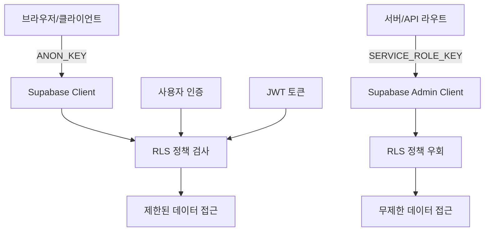

# Supabase 보안/운영 가이드

- 환경 변수/인프라 설정은 [environment-setup.md](../setup/environment-setup.md)
- DB 테이블 설계는 [table-design-specification.md](../setup/table-design-specification.md)
- 규칙 시스템 개요는 [overview.md](./overview.md) 참고

이 문서는 Supabase 환경변수의 올바른 사용법과 보안 아키텍처에 대한 상세한 가이드입니다.

## 📖 개요

Supabase는 클라이언트와 서버에서 서로 다른 권한 수준의 키를 사용하여 보안을 관리합니다. 이 가이드는 각 키의 용도와 올바른 사용법을 설명합니다.

## 🔐 Supabase 키 보안 구분

### ✅ 공개해도 안전한 키들 (클라이언트용)

#### `NEXT_PUBLIC_SUPABASE_URL`

- **용도**: Supabase 프로젝트 URL
- **접근 권한**: 공개 접근 가능
- **사용 위치**: 브라우저, 서버 모두
- **보안 수준**: 공개 정보

#### `NEXT_PUBLIC_SUPABASE_ANON_KEY`

- **용도**: 익명 키 (Anonymous Key)
- **접근 권한**: Row Level Security (RLS) 정책에 의해 제한됨
- **사용 위치**: 브라우저에서 Supabase와 통신
- **보안 수준**: 제한된 권한

**공개해도 안전한 이유:**

- 브라우저에서 Supabase와 통신하기 위해 **반드시 필요**
- Row Level Security (RLS) 정책에 의해 보호됨
- 읽기 전용 또는 제한된 권한만 가짐
- 실제 데이터 접근은 RLS 정책과 사용자 인증에 의해 제어됨

### ❌ 절대 공개하면 안 되는 키 (서버용)

#### `SUPABASE_SERVICE_ROLE_KEY`

- **용도**: 서비스 역할 키
- **접근 권한**: **모든 RLS 정책을 우회**할 수 있는 관리자 권한
- **사용 위치**: 서버 사이드에서만 사용
- **보안 수준**: 최고 권한

**절대 공개하면 안 되는 이유:**

- **모든 RLS 정책을 우회**할 수 있는 관리자 권한
- 데이터베이스의 모든 테이블에 무제한 접근 가능
- 사용자 데이터 삭제, 수정 등 모든 작업 가능
- 브라우저에 노출되면 심각한 보안 위험

## 🏗️ Supabase 보안 아키텍처



### 클라이언트 사이드 보안 흐름

1. **브라우저**에서 `NEXT_PUBLIC_SUPABASE_ANON_KEY` 사용
2. **RLS 정책**이 모든 요청을 검사
3. **사용자 인증 상태**에 따라 접근 권한 결정
4. **제한된 데이터**에만 접근 가능

### 서버 사이드 보안 흐름

1. **API 라우트**에서 `SUPABASE_SERVICE_ROLE_KEY` 사용
2. **RLS 정책 우회**로 관리자 권한 획득
3. **모든 데이터**에 접근 가능
4. **서버에서만** 실행되어 키 노출 방지

## 🔧 올바른 구현 방법

### 환경변수 설정

#### `.env` 파일 (로컬 개발)

```bash
# 클라이언트용 (공개 가능)
NEXT_PUBLIC_SUPABASE_URL=https://your-project.supabase.co
NEXT_PUBLIC_SUPABASE_ANON_KEY=eyJhbGciOiJIUzI1NiIsInR5cCI6IkpXVCJ9...

# 서버용 (절대 공개 금지)
SUPABASE_SERVICE_ROLE_KEY=eyJhbGciOiJIUzI1NiIsInR5cCI6IkpXVCJ9...
```

#### 프로덕션 환경변수

```bash
# Vercel, Netlify 등에서 설정
NEXT_PUBLIC_SUPABASE_URL=https://your-project.supabase.co
NEXT_PUBLIC_SUPABASE_ANON_KEY=eyJhbGciOiJIUzI1NiIsInR5cCI6IkpXVCJ9...
SUPABASE_SERVICE_ROLE_KEY=eyJhbGciOiJIUzI1NiIsInR5cCI6IkpXVCJ9...
```

### 클라이언트 사이드 구현

#### Supabase 클라이언트 생성

```typescript
// src/utils/supabase/client.ts
import { createBrowserSupabaseClient } from '@supabase/auth-helpers-nextjs'

export const createSupabaseClient = () => {
  return createBrowserSupabaseClient(
    process.env.NEXT_PUBLIC_SUPABASE_URL!,
    process.env.NEXT_PUBLIC_SUPABASE_ANON_KEY!
  )
}
```

#### 클라이언트에서 사용

```typescript
// 컴포넌트에서 사용
import { createSupabaseClient } from '@/utils/supabase/client'

export function UserProfile() {
  const supabase = createSupabaseClient()

  const fetchUserData = async () => {
    // RLS 정책에 의해 현재 사용자 데이터만 접근 가능
    const { data, error } = await supabase
      .from('users')
      .select('id, email, name')
      .eq('id', user.id) // 현재 사용자만
  }

  return <div>...</div>
}
```

### 서버 사이드 구현

#### Supabase 관리자 클라이언트 생성

```typescript
// src/utils/supabase/server.ts
import { createClient } from '@supabase/supabase-js'

export const createSupabaseAdminClient = () => {
  const supabaseUrl = process.env.NEXT_PUBLIC_SUPABASE_URL!
  const supabaseServiceKey = process.env.SUPABASE_SERVICE_ROLE_KEY!

  if (!supabaseServiceKey) {
    throw new Error('Missing SUPABASE_SERVICE_ROLE_KEY - Admin client cannot be created')
  }

  return createClient(supabaseUrl, supabaseServiceKey, {
    auth: {
      autoRefreshToken: false,
      persistSession: false
    }
  })
}
```

#### API 라우트에서 사용

```typescript
// src/app/api/admin/users/route.ts
import { createSupabaseAdminClient } from '@/utils/supabase/server'

export async function GET() {
  const supabase = createSupabaseAdminClient()

  // 관리자 권한으로 모든 사용자 데이터 접근 가능
  const { data, error } = await supabase
    .from('users')
    .select('*') // 모든 필드 접근 가능

  return Response.json({ data })
}
```

## 🚨 일반적인 보안 실수들

### ❌ 잘못된 예시들

#### 1. 클라이언트에서 SERVICE_ROLE_KEY 사용

```typescript
// ❌ 절대 하지 마세요!
const supabase = createClient(
  process.env.NEXT_PUBLIC_SUPABASE_URL!,
  process.env.SUPABASE_SERVICE_ROLE_KEY! // 브라우저에 노출됨!
)
```

#### 2. SERVICE_ROLE_KEY를 NEXT_PUBLIC_으로 설정

```bash
# ❌ 절대 하지 마세요!
NEXT_PUBLIC_SUPABASE_SERVICE_ROLE_KEY=eyJhbGciOiJIUzI1NiIsInR5cCI6IkpXVCJ9...
```

#### 3. 클라이언트 컴포넌트에서 관리자 작업 시도

```typescript
// ❌ 잘못된 접근
export function UserManagement() {
  const deleteAllUsers = async () => {
    // 클라이언트에서는 RLS에 의해 차단됨
    const { error } = await supabase
      .from('users')
      .delete()
      .neq('id', 0) // 모든 사용자 삭제 시도
  }
}
```

### ✅ 올바른 해결책

#### 1. 클라이언트/서버 역할 분리

```typescript
// ✅ 클라이언트: 제한된 권한
const clientSupabase = createSupabaseClient() // ANON_KEY 사용

// ✅ 서버: 관리자 권한
const adminSupabase = createSupabaseAdminClient() // SERVICE_ROLE_KEY 사용
```

#### 2. API 라우트를 통한 관리자 작업

```typescript
// ✅ API 라우트에서 관리자 작업
// src/app/api/admin/delete-user/route.ts
export async function DELETE(request: Request) {
  const supabase = createSupabaseAdminClient()

  // 서버에서만 실행되므로 안전
  const { error } = await supabase
    .from('users')
    .delete()
    .eq('id', userId)

  return Response.json({ success: !error })
}
```

#### 3. 클라이언트에서 API 호출

```typescript
// ✅ 클라이언트에서 API 라우트 호출
export function UserManagement() {
  const deleteUser = async (userId: string) => {
    // API 라우트를 통해 안전하게 관리자 작업 수행
    const response = await fetch(`/api/admin/delete-user`, {
      method: 'DELETE',
      body: JSON.stringify({ userId })
    })
  }
}
```

## 🔒 Row Level Security (RLS) 정책 예시

### 사용자 테이블 RLS 정책

```sql
-- 사용자는 자신의 데이터만 조회 가능
CREATE POLICY "Users can view own data" ON users
  FOR SELECT USING (auth.uid() = id);

-- 사용자는 자신의 데이터만 수정 가능
CREATE POLICY "Users can update own data" ON users
  FOR UPDATE USING (auth.uid() = id);

-- 새 사용자 등록 허용
CREATE POLICY "Enable insert for authenticated users" ON users
  FOR INSERT WITH CHECK (auth.uid() = id);
```

### 관리자 전용 테이블 RLS 정책

```sql
-- 관리자만 접근 가능한 테이블
CREATE POLICY "Admin only access" ON admin_logs
  FOR ALL USING (
    EXISTS (
      SELECT 1 FROM users
      WHERE users.id = auth.uid()
      AND users.role = 'admin'
    )
  );
```

## 🛡️ 보안 모범 사례

### 1. 환경변수 관리

- **개발 환경**: `.env` 파일 사용 (`.gitignore`에 추가)
- **프로덕션**: 플랫폼별 환경변수 설정 사용
- **팀 공유**: `.env.example` 파일로 필요한 변수 목록 공유

### 2. 키 순환 (Key Rotation)

```bash
# 정기적으로 키 재생성
# Supabase Dashboard > Settings > API
# 새 키 생성 후 환경변수 업데이트
```

### 3. 접근 로깅

```typescript
// API 라우트에서 관리자 작업 로깅
export async function DELETE(request: Request) {
  const supabase = createSupabaseAdminClient()

  // 관리자 작업 로깅
  await supabase.from('admin_logs').insert({
    action: 'DELETE_USER',
    user_id: userId,
    timestamp: new Date().toISOString(),
    ip_address: request.headers.get('x-forwarded-for')
  })

  // 실제 작업 수행
  const { error } = await supabase
    .from('users')
    .delete()
    .eq('id', userId)
}
```

### 4. 에러 처리

```typescript
// 클라이언트에서 안전한 에러 처리
try {
  const { data, error } = await supabase
    .from('users')
    .select('*')

  if (error) {
    // 사용자에게는 일반적인 메시지만 표시
    console.error('Database error:', error)
    throw new Error('데이터를 불러오는 중 오류가 발생했습니다.')
  }
} catch (error) {
  // 상세한 에러 정보는 로그에만 기록
  console.error('Detailed error:', error)
}
```

## 🔍 보안 검증 체크리스트

### 환경변수 검증

- [ ] `SUPABASE_SERVICE_ROLE_KEY`가 `NEXT_PUBLIC_` 접두사를 사용하지 않는가?
- [ ] 클라이언트 코드에서 `SERVICE_ROLE_KEY`를 직접 사용하지 않는가?
- [ ] 프로덕션 환경변수가 안전하게 설정되어 있는가?

### 코드 검증

- [ ] 관리자 작업이 API 라우트에서만 수행되는가?
- [ ] RLS 정책이 적절히 설정되어 있는가?
- [ ] 클라이언트에서는 ANON_KEY만 사용하는가?

### 접근 제어 검증

- [ ] 사용자가 자신의 데이터만 접근할 수 있는가?
- [ ] 관리자 기능이 적절히 보호되어 있는가?
- [ ] 인증되지 않은 사용자의 접근이 차단되는가?

## 🚨 보안 사고 대응

### 키 노출 시 대응 절차

1. **즉시 키 비활성화**: Supabase Dashboard에서 해당 키 삭제
2. **새 키 생성**: 새로운 SERVICE_ROLE_KEY 생성
3. **환경변수 업데이트**: 모든 환경에서 새 키로 업데이트
4. **로그 확인**: 의심스러운 활동 여부 확인
5. **팀 알림**: 보안 사고 공유 및 재발 방지 교육

### 의심스러운 활동 모니터링

```sql
-- 비정상적인 데이터 접근 패턴 확인
SELECT
  created_at,
  user_id,
  action,
  COUNT(*) as frequency
FROM admin_logs
WHERE created_at > NOW() - INTERVAL '1 hour'
GROUP BY user_id, action
HAVING COUNT(*) > 100; -- 1시간에 100회 이상 작업
```

## 🔗 관련 문서

- [Supabase 공식 보안 가이드](https://supabase.com/docs/guides/auth/row-level-security)
- [Next.js 환경변수 가이드](https://nextjs.org/docs/basic-features/environment-variables)
- [Auth Domain 구현 가이드](../architecture/domainLayer-token-storage-rate-limiting.md)
- [environment-setup.md](../setup/environment-setup.md) — 환경 변수/인프라 설정
- [table-design-specification.md](../setup/table-design-specification.md) — DB 테이블 설계
- [overview.md](./overview.md) — 규칙 시스템 개요
- [directory-architecture.md](../architecture/directory-architecture.md) — 전체 아키텍처

---

이 가이드를 통해 Supabase를 안전하고 효과적으로 사용하여 보안성과 기능성을 모두 확보할 수 있습니다.
